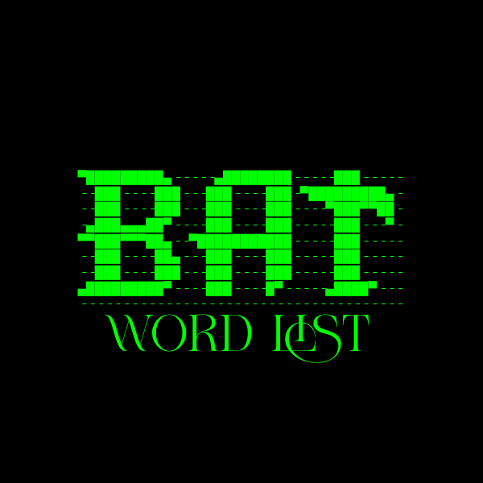

# BAT_WORD_LIST 
#app #apk #wordlist #passwordhack

---

A powerful password word list generator app for Android. Generate 3900+ custom password patterns instantly for ethical hacking, pentesting, and cybersecurity research.

---

## 📱 App Information

- **🧠 App Name**: BAT WORD LIST  
- **💻 Developer**: CYBER NINJAS STUDIO  
- **✍️ Author**: lasith ruwantha Amarawasha
- **🔢 Version**: 1.1.0v  
- **📦 Package Name**: `com.ruwantha.bat.app`

---

## 📥 Download APK

> ✅ Download and install the latest APK directly from GitHub:

📦 **[Download BAT 1.1.0.apk](./bat.apk)**
📦 **[Download BAT 1.1.2.apk](./BAT 1.1.2.apk)

---

## 🛠️ Features

- 🔐 Generates over 3900+ smart password combinations
- ⚙️ Supports symbols, numbers, and custom words
- 🧠 Avoids weak repeated patterns
- 📄 Saves result as `.txt` file
- ⚡ Fast generation in seconds
- 🖥️ Clean terminal-like user interface in app

---

## 📂 How It Works

1. Input your custom words or numbers
2. Click "Generate"
3. Output saved in your device storage as `.txt` wordlist
4. Use it in your pentesting/password cracking tools

---

## ✅ Permissions

- The app may require basic storage permission to save generated wordlists
- Notification access us this app

---

